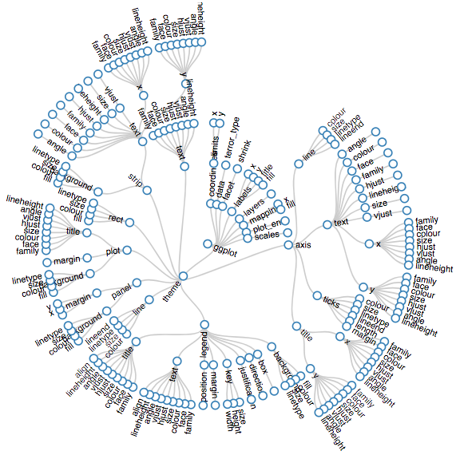

# Plots with `ggplot2`

<style type="text/css">
@import url("https://cdnjs.cloudflare.com/ajax/libs/semantic-ui/2.4.1/semantic.min.css");
</style>

<script src="https://cdnjs.cloudflare.com/ajax/libs/semantic-ui/2.4.1/semantic.js"></script>


## Zwei Funktionen von Datenvisualisierungen

> "The simple graph has brought more information to the data analyst’s mind than any other device." --- John Tukey

* unterschied Exploratory Data Viz vs. Publication Ready Data Viz

**Additional Sources**

* [An Introduction to ggplot2 (UC)](https://uc-r.github.io/ggplot_intro)


## Grammar of Graphics

* A grammar of a language defines the rules of structuring words and phrases into meaningful expressions.
* A grammar of graphics defines the rules of structuring mathematic and aesthetic elements into a meaningful graph.
* allows the user to build a graph from concepts rather than recall of commands and options.

Leland Wilkinson (2005) designed the grammar upon which ggplot2 is based.

<br>

<div class="ui large centered images">
  
  
</div>

* https://gallery.shinyapps.io/ggtree/

<br>

## Die Evolution einer Grafik

Klicke schrittweise auf die Tabs um den Aufbau einer Grafik angefangen bei den Daten zu verdeutlichen.

<div class="tab demo">
<div class="ui secondary menu">
  <div class="active item" data-tab="gg_data">Data</div>
  <div class="item" data-tab="gg_body">Body</div>
  <div class="item" data-tab="gg_aes">Aesthetic</div>
  <div class="item" data-tab="gg_geom">Geom</div>
  <div class="item" data-tab="gg_fill">Fill</div>
  <div class="item" data-tab="gg_alpha">Alpha</div>
  <div class="item" data-tab="gg_labs">Labs</div>
  <div class="item" data-tab="gg_facet">Facets</div>
  <div class="item" data-tab="gg_theme">Facets</div>
</div>

<br>

```{r, echo = F}
pacman::p_load(tidyverse, ggthemes)
start_pirus <- get(load("start_pirus.Rdata")) %>% 
  mutate(violent = ifelse(violent == 1, "Violent", "None-Violent")) 
```


<div class="ui active tab" data-tab="gg_data">

<div class = "ui stackable grid">
<div class = "seven wide column">

```{r ggdata1, echo = T, eval = F, fig.height = 3, fig.width = 5}
start_pirus
```

Am Anfang steht bei ggplot immer ein Dataframe. Idealerweise wurden alle Datentransformationen bereits vor der Erstellung des Plots durchgeführt. Wenn ein Plot mal nicht funktioniert wird in 95% der Fälle etwas mit den Daten oder deren Format nicht stimmen. Deshalb ist es wichtig die Daten und deren Struktur zu verstehen.

</div>
<div class = "eight wide column">


```{r, echo = F}
start_pirus %>% head(5) %>% glimpse()
```


</div>
</div>

</div>


<!-- new tab -->
<div class="ui tab" data-tab="gg_body">

<div class = "ui stackable grid">
<div class = "seven wide column">

```{r ggbody1, echo = T, eval = F, fig.height = 3, fig.width = 5}
start_pirus %>% 
  ggplot()
```

Durch die Funktion `ggplot()` wird das Layout der Grafik initialisiert. Noch sind keine weiteren Informationen spezifiziert (Note: nicht ggplot2, der Name des packages).


</div>
<div class = "seven wide column">

```{r ggbody2, echo = F, eval = T, fig.height = 3, fig.width = 5}
start_pirus %>% 
  ggplot()
```

</div>
</div>

</div>

<!-- AES -->
<div class="ui tab" data-tab="gg_aes">

<div class = "ui stackable grid">
<div class = "seven wide column">

```{r aes1, echo = T, eval = F, fig.height = 3, fig.width = 5}
start_pirus %>% 
  ggplot() +
  aes(x = terror_type)
```

Die Funktion `aes()` definiert welche Variablen für welche Achsen spezifiziert werden. `aes()` hat viele weitere Parameter (Optionen):

* x: positioning along x-axis
* y: positioning along y-axis
* color: color of objects; for 2-d objects, the color of the object’s outline (compare to fill below)
* fill: fill color of objects
* alpha: transparency of objects
* lineterror_type: how lines should be drawn (solid, dashed, dotted, etc.)
* shape: shape of markers in scatter plots
* size: how large objects appear


</div>
<div class = "seven wide column">

```{r aes2, echo = F, eval = T, fig.height = 3, fig.width = 5}
start_pirus %>% 
  ggplot() +
  aes(x = terror_type)
```

</div>
</div>

</div>

<!-- Geom -->
<div class="ui tab" data-tab="gg_geom">

<div class = "ui stackable grid">
<div class = "seven wide column">

```{r geom1, echo = T, eval = F, fig.height = 3, fig.width = 5}
start_pirus %>% 
  ggplot() +
  aes(x = terror_type) +
  geom_bar()
```

Es gibt unzählige `geom_` Funktionen welche für die Datendarstellung verantwortlich sind und ein eine bestimmtes Datenformat erwarten. 

</div>
<div class = "seven wide column">

```{r geom2, echo = F, eval = T, fig.height = 3, fig.width = 5}
start_pirus %>% 
  ggplot() +
  aes(x = terror_type) +
  geom_bar()
```

</div>
</div>

</div>

<!-- Colour -->
<div class="ui tab" data-tab="gg_fill">

<div class = "ui stackable grid">
<div class = "seven wide column">

```{r fill1, echo = T, eval = F, fig.height = 3, fig.width = 5}
start_pirus %>% 
  ggplot() +
  aes(x = terror_type, fill = terror_type) +
  geom_bar()
```

Es gibt zwei Farb-parameter `fill` und `colour`. `fill` wird verwendet um Flächen zu kolorieren und `colour` um Lines (Outlines) und Points einzufärben. 

</div>
<div class = "seven wide column">

```{r fill2, echo = F, eval = T, fig.height = 3, fig.width = 5}
start_pirus %>% 
  ggplot() +
  aes(x = terror_type, fill = terror_type) +
  geom_bar()
```

</div>
</div>

</div>

<!-- Alpha -->
<div class="ui tab" data-tab="gg_alpha">

<div class = "ui stackable grid">
<div class = "seven wide column">

```{r alpha1, echo = T, eval = F, fig.height = 3, fig.width = 5}
start_pirus %>% 
  ggplot() +
  aes(x = terror_type, fill = terror_type) +
  geom_bar(alpha = .7)
```

Mit `alpha` wird die Intensität der Farbe eingestellt. 0 bedeutet komplett durchsichtig; 1 volle Sättigung.


</div>
<div class = "seven wide column">

```{r alpha2, echo = F, eval = T, fig.height = 3, fig.width = 5}
start_pirus %>% 
  ggplot() +
  aes(x = terror_type, fill = terror_type) +
  geom_bar(alpha = .7)
```

</div>
</div>

</div>


<!-- Labels -->
<div class="ui tab" data-tab="gg_labs">

<div class = "ui stackable grid">
<div class = "seven wide column">

```{r labs1, echo = T, eval = F, fig.height = 3, fig.width = 5}
start_pirus %>% 
  ggplot() +
  aes(x = terror_type, fill = terror_type) +
  geom_bar(alpha = .7) +
  labs(x = "Terror Types", y = "Frequency", title = "Frequency by Terror Type") 
```

Die Lables an einem Plot dürfen natürlich nicht fehlen. 

</div>
<div class = "seven wide column">

```{r labs2, echo = F, eval = T, fig.height = 3, fig.width = 5}
start_pirus %>% 
  ggplot() +
  aes(x = terror_type, fill = terror_type) +
  geom_bar(alpha = .7) +
  labs(x = "Terror Types", y = "Frequency", title = "Frequency by Terror Type")
```

</div>
</div>

</div>

<!-- Facets -->
<div class="ui tab" data-tab="gg_facet">

<div class = "ui stackable grid">
<div class = "seven wide column">

```{r facet1, echo = T, eval = F, fig.height = 3, fig.width = 5}
start_pirus %>% 
  ggplot() +
  aes(x = terror_type, fill = terror_type) +
  geom_bar(alpha = .7) +
  labs(x = "Terror Types", y = "Frequency", title = "Frequency by Terror Type") +
  facet_wrap(~violent)
```

Mit `facet_wrap` kann ein Plot über mehrere Dimensionen aufgefächert werden.

</div>
<div class = "seven wide column">

```{r facet2, echo = F, eval = T, fig.height = 3, fig.width = 5}
start_pirus %>% 
  ggplot() +
  aes(x = terror_type, fill = terror_type) +
  geom_bar(alpha = .7) +
  labs(x = "Terror Types", y = "Frequency", title = "Frequency by Terror Type") +
  facet_wrap(~violent)
```

</div>
</div>

</div>


<!-- theme -->
<div class="ui tab" data-tab="gg_theme">

<div class = "ui stackable grid">
<div class = "seven wide column">

```{r theme, echo = T, eval = F, fig.height = 3, fig.width = 5}
start_pirus %>% 
  ggplot() +
  aes(x = terror_type, fill = terror_type) +
  geom_bar(alpha = .7) +
  labs(x = "", y = "Frequency", title = "Frequency by Terror Type") +
  facet_wrap(~violent) +
  theme_classic() + 
  theme(legend.position = "bottom")
```

Mit `facet_wrap` kann ein Plot über mehrere Dimensionen aufgefächert werden.

</div>
<div class = "seven wide column">

```{r theme420, echo = F, eval = T, fig.height = 3, fig.width = 5}
start_pirus %>% 
  ggplot() +
  aes(x = terror_type, fill = terror_type) +
  geom_bar(alpha = .7) +
  labs(x = "", y = "Frequency", title = "Frequency by Terror Type") +
  facet_wrap(~violent) +
  theme_classic() +
  theme(legend.position = "bottom")
```

</div>
</div>

</div>

<!-- class: .tab.demo -->
</div>
<script type="text/javascript">
$(document)
  .ready(function(){
    $('.tab.demo .menu .item')
      .tab({
        context: $('.tab.demo')
      })
    ;
  })
;
</script>


## Welche Geoms gibts es?

`geom_<type>`

```{r, eval = F}
geoms_list <- help.search("geom_", package = "ggplot2")
geoms_list$matches %>% 
  select(Topic, Title) %>% 
  slice(1:10)
```


## Farben

* colourpicker -> Addin

## Plot Theming

<div id = "themes">
<div class="ui secondary menu">
  <div class="active item" data-tab="gg_default">Deafult</div>
  <div class="item" data-tab="gg_bw">BW</div>
  <div class="item" data-tab="gg_hc">HC</div>
  <div class="item" data-tab="gg_gdocs">Gdocs</div>
</div>
</div>

<div class="ui active tab" data-tab="gg_default">

<div class = "ui stackable grid">
<div class = "seven wide column">

```{r default1, echo = T, eval = T, fig.height = 3, fig.width = 5}
start_pirus %>% 
  ggplot() +
  aes(x = terror_type, fill = terror_type) +
  geom_bar(alpha = .7) 
```

</div>
<div class = "seven wide column">

```{r default2, echo = T, eval = T, fig.height = 3, fig.width = 5}
start_pirus %>% 
  count(year, terror_type) %>% 
  ggplot(aes(year, n, colour = terror_type)) +
  geom_line()
```

</div>
</div>

</div>

<div class="ui tab" data-tab="gg_bw">

<div class = "ui stackable grid">
<div class = "seven wide column">

```{r bw1, echo = T, eval = T, fig.height = 3, fig.width = 5}
start_pirus %>% 
  ggplot() +
  aes(x = terror_type, fill = terror_type) +
  geom_bar(alpha = .7) +
  scale_fill_grey("TITLE") +
  theme_bw()
```

</div>
<div class = "seven wide column">

```{r bw2, echo = T, eval = T, fig.height = 3, fig.width = 5}
start_pirus %>%
  count(year, terror_type) %>% 
  ggplot(aes(year, n, colour = terror_type)) +
  geom_line() +
  scale_colour_grey("TITLE") +
  theme_bw()
```

</div>
</div>

</div>


<div class="ui tab" data-tab="gg_hc">

<div class = "ui stackable grid">
<div class = "seven wide column">

```{r hc1, echo = T, eval = T, fig.height = 3, fig.width = 5}
library(ggthemes)
start_pirus %>% 
  ggplot() +
  aes(x = terror_type, fill = terror_type) +
  geom_bar(alpha = .7) +
  scale_fill_hc(name = "TITLE") +
  theme_hc()
```

</div>
<div class = "seven wide column">

```{r hc2, echo = T, eval = T, fig.height = 3, fig.width = 5}
library(ggthemes)
start_pirus %>%
  count(year, terror_type) %>% 
  ggplot(aes(year, n, colour = terror_type)) +
  geom_line() +
  scale_colour_hc(name = "TITLE") +
  theme_hc()
```

</div>
</div>

</div>


<div class="ui tab" data-tab="gg_gdocs">

<div class = "ui stackable grid">
<div class = "seven wide column">

```{r gdocs1, echo = T, eval = T, fig.height = 3, fig.width = 5}
library(ggthemes)
start_pirus %>% 
  ggplot() +
  aes(x = terror_type, fill = terror_type) +
  geom_bar(alpha = .7) +
  scale_fill_gdocs(name = "TITLE") +
  theme_gdocs()
```

</div>
<div class = "seven wide column">

```{r gdocs2, echo = T, eval = T, fig.height = 3, fig.width = 5}
library(ggthemes)
start_pirus %>%
  count(year, terror_type) %>% 
  ggplot(aes(year, n, colour = terror_type)) +
  geom_line() +
  scale_colour_gdocs(name = "TITLE") +
  theme_gdocs()
```

</div>
</div>

</div>


<script>
$('#themes .menu .item')
  .tab({
    context: $('#themes')
  })
;
</script>


<br>
<br>

## Some Informative Plots

```{r}
start_pirus %>% 
  ggplot(aes(date, terror_type, colour = terror_type)) +
  geom_jitter(alpha = .5) +
  theme(legend.position = "none") +
  labs(x = "", y = "")
```


```{r}
start_pirus %>% 
  ggplot(aes(date, terror_type, colour = terror_type)) +
  geom_jitter(alpha = .5) +
  theme(legend.position = "none") +
  labs(x = "", y = "") +
  facet_wrap(~violent)
```

```{r}
start_pirus %>% 
  mutate(year = lubridate::year(date)) %>% 
  count(year, violent) %>% 
  ggplot(aes(year, n, colour = violent)) +
  geom_line()
```


```{r}
start_pirus %>% 
  count(year, terror_type) %>% 
  ggplot(aes(year, n, colour = terror_type)) +
  geom_line()
```


```{r, eval = F, echo = F}
start_pirus %>% 
  drop_na(radicalization) %>% 
  #mutate(violent = ifelse(violent == 1, "Violent", "None-Violent")) %>% 
  mutate(date = as.Date(date, origin = "1899-12-30")) %>% #origin="1970-01-01")) %>%   
  mutate(year = lubridate::year(date) %/% 3) %>% 
  group_by(year) %>% 
  count(radicalization) %>% 
  mutate(perc = n/sum(n)) %>% 
  ungroup %>% 
  ggplot(aes(year, perc, fill = radicalization)) +
  geom_col(alpha = .7)
```


<!-- <div class="ui shape"> -->
<!--   <div class="sides"> -->
<!--   <div class="active side">This side starts visible.</div> -->
<!--   <div class="side">This is yet another side</div> -->
<!--   <div class="side">This is the last side</div> -->
<!--   </div> -->
<!-- </div> -->
<!-- <div class = "ui teal button" id = "flip">Flip</div> -->
<!-- <script> -->
<!-- $(document).ready(function() { -->
<!--   $('.shape').shape(); -->
<!--   $('#flip').click(function({ -->
<!--     $('.ui.shape').shape('flip up') -->
<!--   })); -->
<!-- }); -->
<!-- </script> -->


