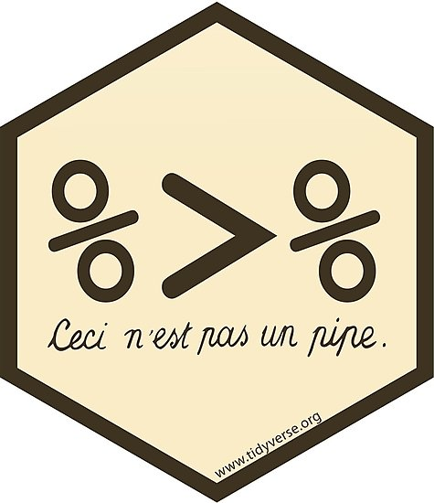
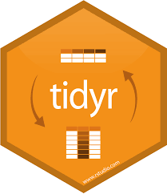

 
 

<h1>
  Einführung in Computational Social Science mit R
</h1>

 

<h3>
Course Description
</h3>

Dies ist ein 5 Stunden Einführungsworkshop für Sozialwissenschaftler der für die Uni Stuttgart 9.11.2018 konzipiert wurde.

Dieser anwendungsorientierte Workshop für Sozialwissenschaftler ist konzipiert für Personen mit wenig Programmiererfahrung  mit der Statistik-Software R. Gemeinsam bearbeiten wir den PIRUS Datensatz, welcher Informationen auf individueller Ebene zu Hintergründen, Attributen und Radikalisierungsprozessen von über 1.800 politischen Extremisten in den USA beinhaltet. Ziel des Workshop ist, dass die Studierenden selbst eine Analyse in R durchgeführt haben um danach eigene Fragestellungen untersuchen zu können. Dazu werden wir sowohl moderne Tools zur Datenverarbeitung und Visualisierung benutzen, als auch erste statistische Modelle implementieren. Statistische Vorkenntnisse sind zwar von Vorteil, müssen aber nicht vorhanden sein. Der Workshop findet am 09.11.2018 von 9-16 Uhr im CIP Pool der Breitscheidtstraße (Politikwissenschaft) statt.

Wenn euer Interesse geweckt ist, meldet euch bitte unter folgendem Link an damit ihr auf die Kursmaterialien zugreifen könnt:

 

<!-- <a href = "https://goo.gl/forms/72Zny402mPqW5na72", target = "_blank"> -->
<!--   <button class="ui center aligned secondary button">Sign up</button> -->
<!-- </a> -->
<a href = "https://github.com/favstats/css_workshop", target = "_blank">
  <button class="ui center aligned icon button"> <i class="github icon"></i> Github</button>
</a>
<a href = "https://rstudio.cloud/spaces/6163/join?access_code=LbeO0T%2F1q9AJn2ssnDNWox2P8ojVrxDQaIckRlmv", target = "_blank">
  <button class="ui center aligned primary icon button"> <i class="registered icon"></i> Cloud</button>
</a>

 
 

Alle weiteren Informationen findet ihr in unserer Facebook-Gruppe: https://www.facebook.com/groups/rstuttgart/
 
 
Wir freuen uns auf euer Erscheinen, 

die R User Group Stuttgart 

<h2>Tools</h2>

  
  

<h2>Packages</h2>

  
  
  
  
  

<h2 class = "ui disabled header">Not covered in this Workshop</h2>

<h2>Workflow</h2>

1. Import data into R: read_csv(), readLines(), read_delim()
2. Tidy data - variables per column, observation by row
3. Tranform with dplyr
4. Visualize with ggplot2

(Wickham and Grolemund, 2017)

 

